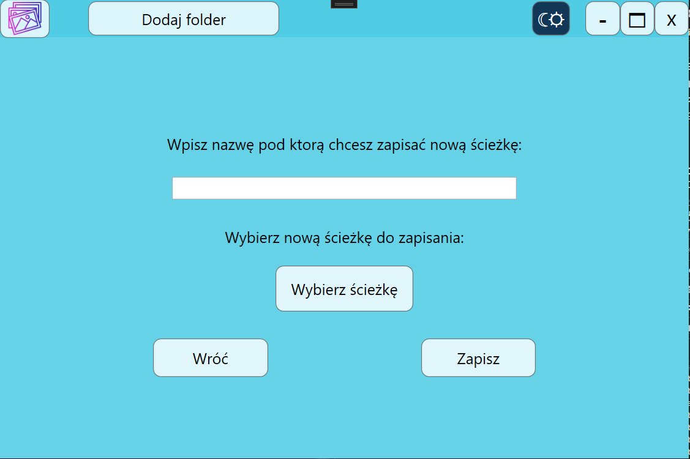
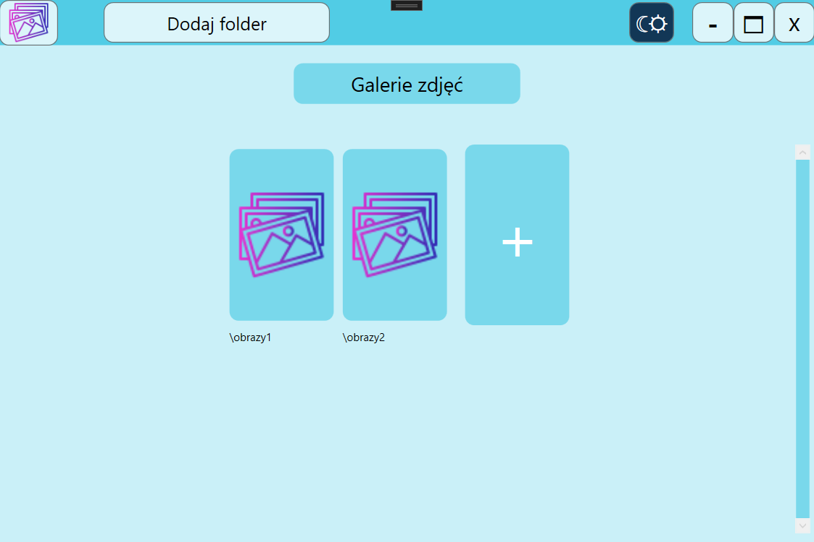
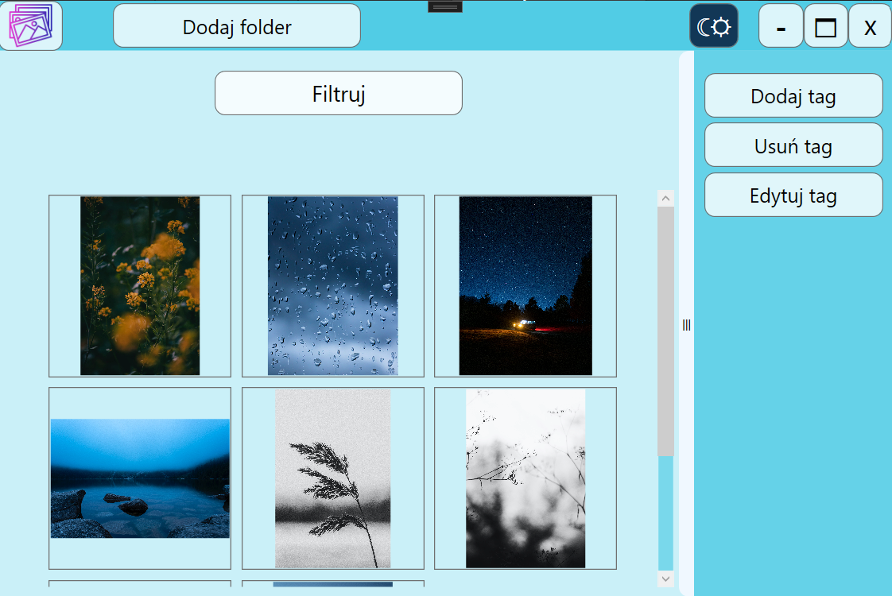
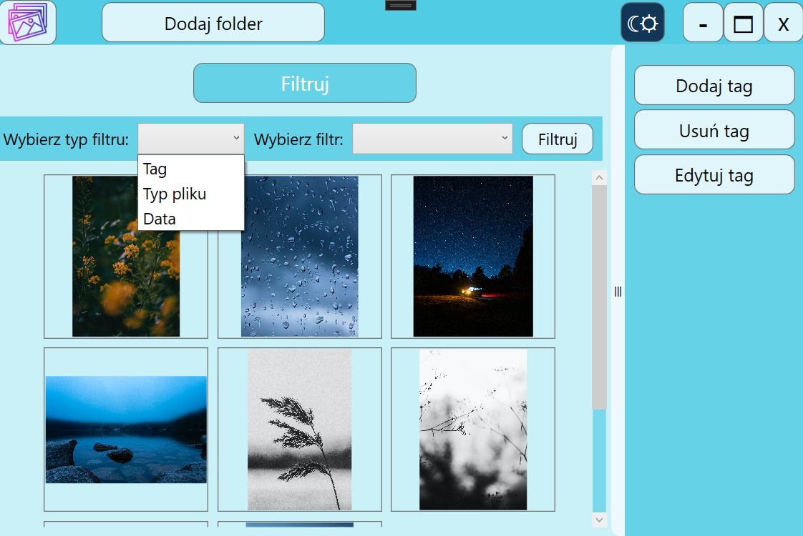
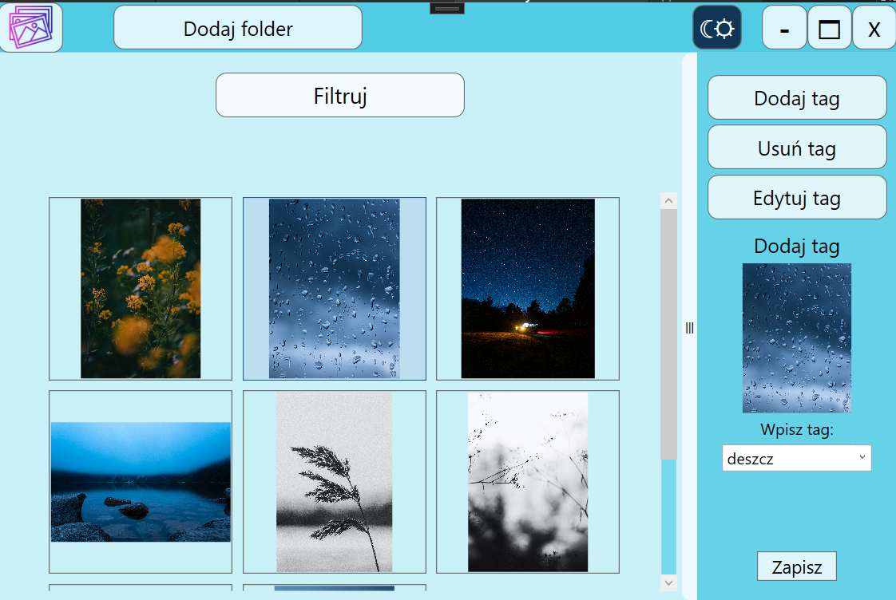
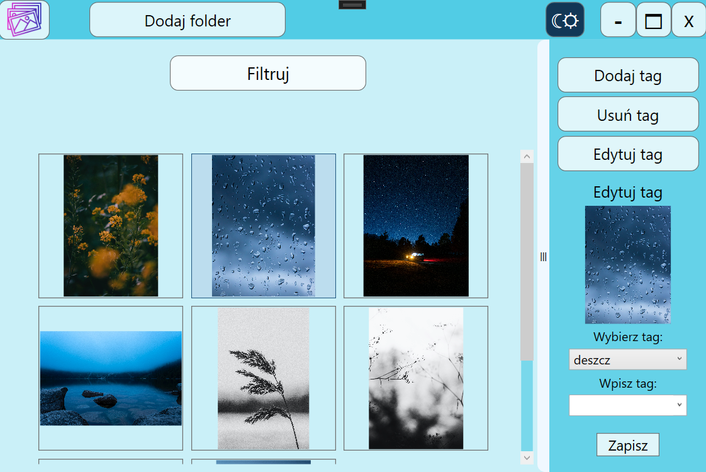
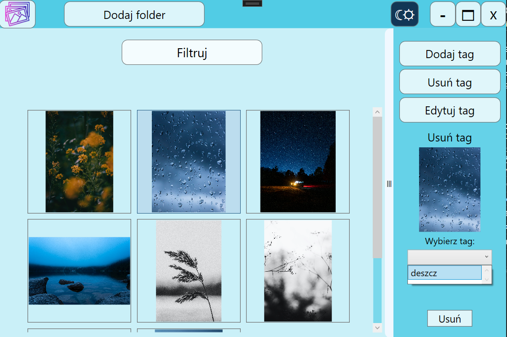
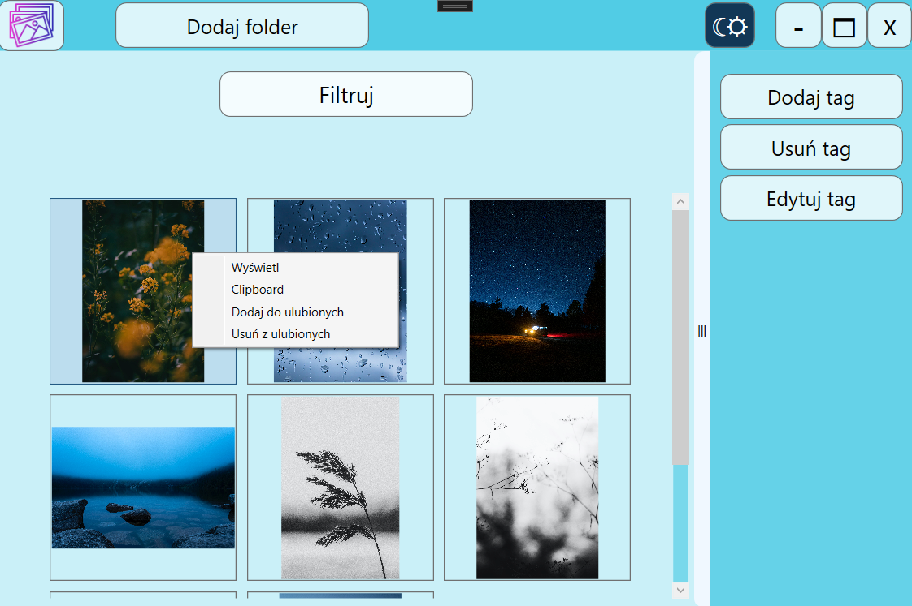
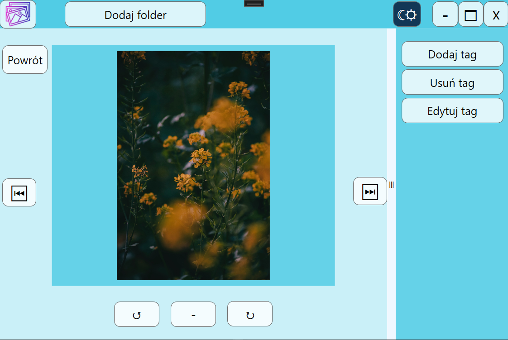
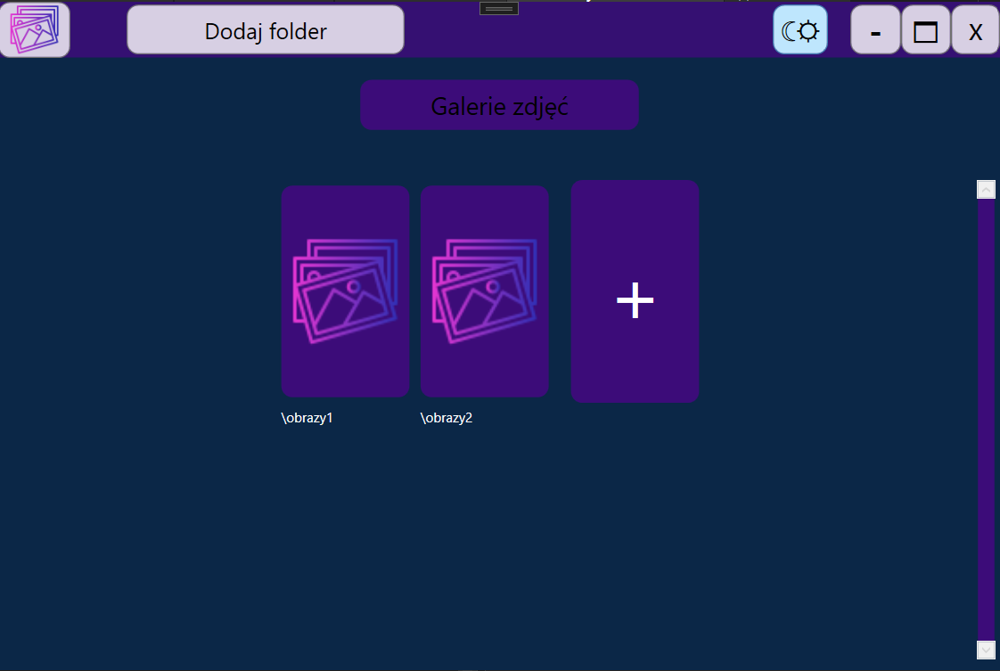

# Photo Manager
> WPF photo manager app.

## Table of Contents
* [General Info](#general-information)
* [Technologies Used](#technologies-used)
* [Features](#features)
* [Screenshots](#screenshots)
* [Setup](#setup)
* [Project Status](#project-status)
* [Room for Improvement](#room-for-improvement)

## General Information
Desktop application for managing photos and videos. Created as a personal project for practice purposes.  
It's a simple tool for viewing, organizing and tagging photos in chosen by user directories.  
Application is fully functional and responsive.  
Implements MVVM pattern.

## Technologies Used
- WPF
- .NET - version: 7.0

## Features
App main features:
- Adding and saving directories from which user wants to load photos.
- Viewing list of saved directories.
- Viewing gallery of all photos and videos from chosen directory (currently supported file types: jpg, png, jpeg, mp4, webm).
- Adding, deleting and editing tags for chosen by user photos.
- Filtering photos by tags and by file types.
- Sorting files by date.
- Viewing photos.
- Copying photos to clipboard.
- Adding/removing photos from favorites.
- Rotating photos.
- Full screen view.
- Light/dark theme option.
- Checking user system applications theme settings on startup.

## Screenshots

Adding new directory path:

Application main window:

Photos gallery view:

Filtering:

Adding new tag to photo:

Editing existing tag in photo:

Deleting existing tag from photo:

Context menu with additional options:

Photo viewing:

App dark theme:

## Setup
Dependencies:
- Newtonsoft.Json - version: 13.0.3
- Microsoft.Extensions.DependencyInjection - version: 7.0.0

Local environment:
- Visual Studio 2022

## Project Status
Project is:  _complete_   
Currently project is completed. All planned features have been implemented.

## Room for Improvement
Room for improvement:
- Improving speed of loading gallery of photos from directory (specifically in case of folders with large amount of photos).

